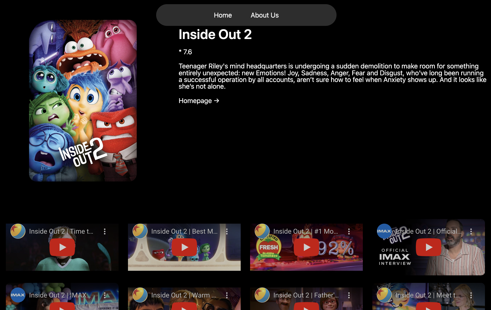

# Overview
This project is aimed at studying the basic concepts and features of Next.js. The main objective is to build a simple movie listing application, covering essential Next.js functionalities. This app is deployed with Vercel.

## Main Features

1. **Homepage**:
   - Displays a list of movies fetched from an external API.
   - Each movie is displayed with a poster and title.
   - The movie list is laid out in a responsive grid format.

   

2. **Movie Info Page**:
   - Provides detailed information about the selected movie.
   - Includes the movie title, rating, and description.
   - Displays a collection of videos related to the selected movie.
   - Each video is embedded and can be played directly on the page.

   

## Project Structure
- pages/: Contains the main pages of the application, including the homepage and movie detail pages.
- components/: Contains reusable components like the movie item and navigation bar.
- styles/: Contains CSS modules for styling individual components and pages.

## Topics Covered

- Routing and Nested Routes
- Dynamic Routes
- Server-Side Rendering (SSR)
- Static Generation
- Data Fetching (getServerSideProps, getStaticProps)
- API Integration
- Prefetching Links
- CSS Modules for Styling